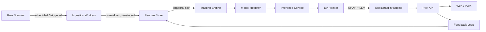
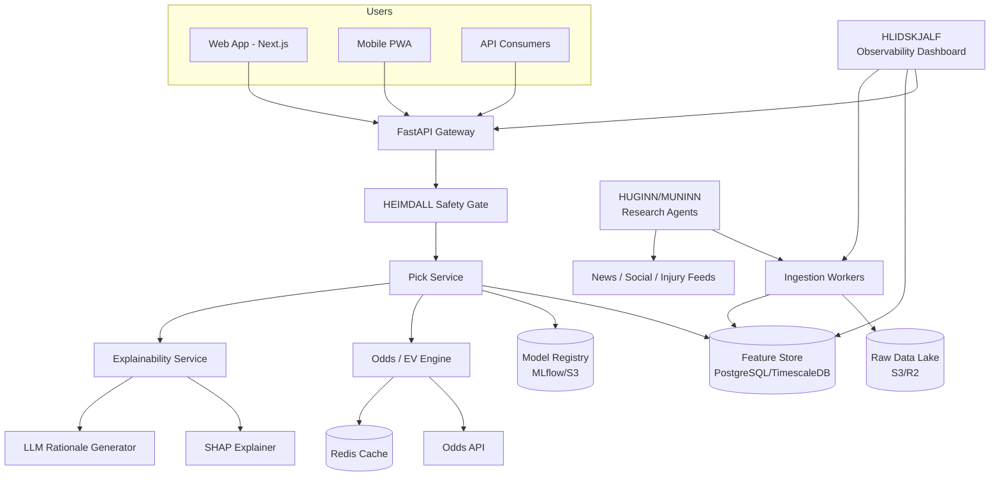

# ODINBET Blueprint: AI-Powered Sports Betting Picker Platform

> **Scope:** Product + technical blueprint for a small team (2-3 developers, moderate budget).  
> **Constraint:** ODINBET is a research/analytics platform. It does **not** accept wagers, hold funds, or operate as a bookmaker. All picks are advisory and must be paired with responsible-gambling disclaimers and user controls.

---

## Part 1: Strategic Planning & Architecture

### 1.1 Core Value Proposition

ODINBET turns noisy sports data into a ranked list of statistically favorable betting picks, each delivered with a transparent evidence card and a bankroll-aware stake recommendation.

| Differentiator | What it means in practice |
|---|---|
| **Explainability first** | Every pick shows the top 5 drivers (SHAP), a natural-language rationale, and the data sources used. Users understand *why*, not just *what*. |
| **Market-aware EV** | The model estimates true win probability and compares it to the vig-free market-implied probability. Only positive expected-value (+EV) opportunities are surfaced. |
| **Bankroll discipline** | Built-in fractional Kelly sizing, daily loss caps, and stop-losses prevent ruinous stake sizing. |
| **Agentic research** | Breaking injury, weather, or lineup news triggers near-real-time re-runs via ODIN research agents (HUGINN/MUNINN). |
| **Audit trail** | Every pick is versioned with model ID, feature snapshot, odds used, and eventual outcome. |

### 1.2 Target Users

| Persona | Profile | Need | Monetization |
|---|---|---|---|
| **The Quant Bettor** | Tracks closing line value (CLV), keeps spreadsheets | Accurate probabilities, line shopping, backtests | Paid tier |
| **The Content Creator** | Posts picks to followers, Discord, YouTube | Citable evidence cards, exportable summaries, fast turnaround | Paid + affiliate |
| **The Small Syndicate** | 2-5 people sharing a bankroll | Multi-user paper portfolio, role-based access, API | Team/enterprise tier |
| **The Recreational User** | Bets casually for entertainment | Curated daily picks, clear risk warnings, loss limits | Free tier + upsell |

### 1.3 Data Sources

Start free/open-source in MVP, then add paid feeds in Beta. Avoid scraping bookmakers directly; it violates ToS and is structurally brittle.

| Domain | Examples | Data type | Budget phase |
|---|---|---|---|
| **Schedule / box scores** | `nba_api`, `nfl-data-py`, `MLB-StatsAPI`, `football-data.org`, `sportsdataverse`, TheSportsDB (free tier) | Results, team stats, play-by-play | MVP |
| **Odds / lines** | The-Odds-API, OddsJam, Pinnacle (closed to public), sportsbook affiliate feeds | Moneyline, spread, totals, vig-free implied probs | MVP (The-Odds-API free tier) |
| **Player / advanced stats** | Basketball-Reference, FBref, Understat, Hockey-Reference, official league APIs | Player ratings, advanced box-score stats | MVP (open) |
| **Injuries / lineups** | Rotowire API, Underdog API, ESPN injury reports, official league status feeds | Active/inactive, minutes projections | Beta |
| **Weather** | OpenWeatherMap, Visual Crossing | Temp, wind, precipitation, humidity | Beta (MLB/NFL) |
| **News / sentiment** | NewsAPI, GDELT, Reddit (PRAW), Google News RSS, official team beat reporters | Breaking news, fan sentiment | Beta |
| **Market / public action** | Action Network (paid), SportsInsights, line movement as proxy | Public bet %, sharp line movement | Beta/V1.0 |
| **Travel / schedule** | Derived from schedule data + timezone libraries | Rest days, distance, back-to-backs | MVP |

**Budget rule:** < $200/month on data in MVP; < $1,000/month in Beta. Use S3/MinIO for raw data lake and bulk download free historical datasets first.

### 1.4 AI/ML Pipeline



1. **Ingestion:** Idempotent pulls from source APIs. Every raw file is timestamped and stored in object storage (Parquet/JSONL). Failures are retried with bounded exponential backoff.
2. **Normalization:** Maps every league/team/player to canonical IDs. Handles name aliases, trades, and mid-season team changes.
3. **Feature Engineering:** Time-aware aggregates (rolling 5/10/20 games), home/away splits, rest days, travel, injuries, weather, market features. Strictly no target leakage.
4. **Training:** Walk-forward validation. Candidate models: XGBoost, LightGBM, regularized logistic regression. Ensemble via log-loss-weighted blend.
5. **Calibration:** Platt scaling or isotonic regression on a holdout set. ECE target < 0.03.
6. **Inference:** Scheduled at lock times and on-demand. Inference latency target < 500 ms per batch.
7. **EV Ranking:** `EV = model_prob * decimal_odds - 1`. Filter `EV > threshold` (default 2 %) and `confidence > 0.55`.
8. **Explainability:** SHAP top drivers + a short LLM-generated rationale (Claude Haiku/Sonnet) summarizing the evidence.
9. **Feedback:** Store actual outcomes, closing line, and result. Feed back into model retraining and drift detection.

### 1.5 Model Selection

| Model | Role | When to use |
|---|---|---|
| **Market-implied baseline** | Vig-free odds probability | Always run as a sanity check; the model must beat this in backtests. |
| **Elo / logistic baseline** | Hand-engineered features | Fast, interpretable, builds trust. |
| **XGBoost / LightGBM** | Primary classifier/regressor | Tabular SOTA, fast to train, easy SHAP explainability. |
| **CatBoost** | Candidate for high-cardinality categorical features (teams, players) | Tested in Beta if XGBoost is underfitting. |
| **Ensemble (stacked blend)** | Final probability | Weighted by inverse validation log-loss; improves calibration. |
| **Sequence model (optional V1.0)** | Player/team form embeddings | LSTM/Transformer over recent game sequences only if data and compute budget allow. |

**Outputs per pick:**
- `model_probability`: probability of the selected outcome.
- `confidence_interval`: 90 % interval from calibrated probabilities or Monte Carlo.
- `expected_value`: +EV as a percentage.
- `recommended_units`: bankroll fraction using fractional Kelly.
- `shap_drivers`: top 5 features and their directional effect.

### 1.6 Tech Stack

| Layer | Technology | Rationale |
|---|---|---|
| Language / API | Python 3.11 + FastAPI | Native ML ecosystem, async I/O, OpenAPI docs out of the box. |
| ML | XGBoost, LightGBM, Optuna, SHAP, scikit-learn, Polars | Proven, fast, interpretable tabular stack. |
| Data store | PostgreSQL + TimescaleDB | Relational data + time-series features/odds. |
| Cache / job queue | Redis + Celery or RQ | Simple, reliable, cheap to run. |
| Object storage | S3 / Cloudflare R2 / MinIO | Cheap Parquet/artifact storage. |
| Ingestion orchestration | Prefect 3 OSS or cron + Celery | Lightweight orchestration; avoid heavy Airflow in MVP. |
| Frontend | Next.js 14 (App Router) + TypeScript + Tailwind CSS | Fast SSR, easy Vercel deploy, PWA-ready. |
| Auth / users | Supabase Auth | Managed auth with RLS-ready Postgres. |
| Billing | Stripe | Subscription tiers and usage-based add-ons. |
| LLM / explanations | Anthropic Claude via the ODIN LLM adapter | Low-latency rationale generation; swap provider as needed. |
| Experiment tracking | MLflow (self-hosted) or Weights & Biases | Model registry, hyperparameter sweep history. |
| Deployment | Docker + Fly.io or Render (MVP); Hetzner/AWS (scale) | Budget-friendly managed infra that grows. |
| Monitoring | Sentry + Prometheus/Grafana + uptime checks | Errors, latency, data freshness, model drift, cost per pick. |

### 1.7 System Architecture



**Data flow:**
1. Ingestion workers pull raw data on a schedule (every 6-24 hours, plus triggers) and write to the data lake.
2. Feature pipeline reads raw data, computes aggregates, and writes to the feature store.
3. Pick service requests the latest features and current odds, loads the active model, runs inference, ranks by EV, and generates explanation cards.
4. Web/PWA calls the API; API returns a list of picks with evidence and stake recommendations.
5. Research agents monitor news feeds; on breaking events, they trigger a targeted re-ingestion and re-inference run.
6. HEIMDALL gates the API and ingestion: budget/cost caps, no betting-execution paths, and responsible-gambling policy checks.
7. HLIDSKJALF gives the team a live view of pipeline health, model drift, bankroll simulations, and cost per pick.

### 1.8 ODIN Pantheon Alignment

ODINBET is an end-user application that can be built *on* the ODIN agent orchestration framework. For an MVP, the core pipeline can be standalone; for V1.0 the Pantheon components are wired in.

| ODIN Component | Role in ODINBET |
|---|---|
| **ODIN (Planner)** | Decomposes "Generate tonight's picks" into sub-tasks: fetch data, build features, run models, rank EV, render cards. |
| **THOR (Executor)** | Runs data ingestion, feature computation, model inference, and odds queries. |
| **LOKI (Critic)** | Adversarial review of each pick: checks for data leakage, missing injuries, stale odds, and overconfident model outputs. Abstains if confidence is too low. |
| **FREYA (Renderer)** | Produces the final pick card: headline, probability, EV, SHAP drivers, and natural-language rationale. |
| **MIMIR (Memory)** | Stores historical picks, outcomes, team/player embeddings, and reflection memory (why a pick failed). |
| **HEIMDALL (Safety)** | Enforces cost/token budgets, blocks any attempt to execute real bets, gates high-risk markets, and logs audit trails. |
| **HUGINN / MUNINN** | Live research agents that scan news/social for injuries, weather, or lineup changes and trigger recalculation. |
| **HLIDSKJALF** | Observability dashboard for the pick pipeline, model drift, bankroll, and ROI. |

### 1.9 Risk Management

#### Variance & Edge Reality
- Sports betting is high-variance. A 5 % edge still produces long losing streaks.
- Monte Carlo simulate 1,000 seasons of picks to show a 90 % drawdown/confidence band before a user stakes real money.
- Display a "variance warning" when a pick's outcome distribution has high volatility (e.g., underdog moneyline with low sample size).
- Abstain when model confidence is below `0.55` or EV is below `0.02`.

#### Bankroll Management
- **Fractional Kelly:** `f* = (bp - q) / b`, where `b = decimal odds - 1`, `p = model probability`, `q = 1 - p`. Use a default fraction of `1/4` to `1/8` to reduce variance.
- **Stake caps:** Max 2 % of bankroll per pick; max 5 % total exposure per day.
- **Stop-loss:** Hard stop at daily/weekly loss limits (default 5 % / 15 % of bankroll). 
- **Cooldown:** After 3 consecutive losses, require a 24-hour pause before new real-money picks are shown (paper trading still allowed).

```python
def kelly_stake(
    bankroll: float,
    decimal_odds: float,
    model_probability: float,
    fraction: float = 0.25,
    max_risk: float = 0.02,
) -> float:
    """Return recommended stake in currency."""
    net_odds = decimal_odds - 1.0
    kelly = (net_odds * model_probability - (1 - model_probability)) / net_odds
    stake = bankroll * max(0.0, kelly) * fraction
    return min(stake, bankroll * max_risk)
```

#### Responsible Gambling & Compliance
- **No wagering execution:** The platform never places a bet, connects to a sportsbook account, or holds funds.
- **Disclaimers:** Every screen shows "For entertainment and research only. Past performance does not guarantee future results." Picks are not financial advice.
- **User controls:** Set deposit, loss, and time limits; self-exclusion; cool-off periods.
- **Resources:** Links to NCPG (US), GamCare (UK), GamStop, etc.
- **Age gating:** Require 18+/21+ confirmation at signup and in terms of service.
- **Jurisdiction:** Block users in regions where sports-betting advice is restricted until legal review is complete.
- **Audit:** Immutable log of every pick shown, model version, and user action for compliance disputes.

---

## Part 2: Step-by-Step Build Blueprint

### 2.1 Phase Overview

| Phase | Goal | Elapsed (2-3 devs) | Person-days | Exit Criteria |
|---|---|---|---|---|
| **MVP** | One sport, moneyline/spread/totals, ranked picks, bankroll tracker, paper trading | 3-4 weeks | ~35 | Pick API live, paper ROI positive vs market closing line, calibration ECE < 0.05. |
| **Beta** | Multi-sport, richer data, ensemble + SHAP, accounts, subscriptions, research agents | 6-8 weeks | ~55 | 500 beta users, paid conversions, CLV positive, pipeline uptime > 99 %. |
| **V1.0** | Full multi-sport, live/in-game, ODIN Pantheon, mobile PWA, compliance hardening | 10-12 weeks | ~85 | Paid subscriptions, stable infra, security/compliance review passed. |

### 2.2 Phase 1 — MVP

| # | Task | Effort | Owner | Dependencies | Deliverable |
|---|---|---|---|---|---|
| 1.1 | Repo bootstrap, CI/CD (GitHub Actions, ruff, mypy, pytest, Docker) | 2 d | BE | — | `main` branch green, Docker Compose local. |
| 1.2 | Data contracts + ingestion adapter for one sport (e.g., NBA via `nba_api`) | 4 d | BE/ML | 1.1 | Normalized `RawGame`, `PlayerStat`, `Odds` schemas, S3 raw lake. |
| 1.3 | Feature store + feature engineering (rolling stats, home/away, rest, travel) | 5 d | ML | 1.2 | Feature tables in TimescaleDB, no leakage tests. |
| 1.4 | Baseline model + XGBoost training/evaluation pipeline | 5 d | ML | 1.3 | Trained model artifact, backtest report (log-loss, ROI, ECE). |
| 1.5 | Prediction service + EV ranker (FastAPI) | 4 d | BE | 1.4 | `/picks` endpoint, unit tests. |
| 1.6 | Frontend MVP: pick list, pick card, bankroll widget, disclaimer | 6 d | FE | 1.5 | Next.js app, responsive, PWA-ready. |
| 1.7 | Bankroll manager + paper trading ledger | 3 d | BE/FE | 1.5 | User bankroll, recommended units, outcome tracking. |
| 1.8 | Backtesting harness + responsible-gambling controls | 3 d | ML/BE | 1.4/1.7 | Season replay, daily loss cap, Kelly sizing. |
| 1.9 | Staging deploy + docs | 3 d | BE/FE | All | Staging URL, README, API docs. |

**MVP dependencies (critical path):** `1.1 → 1.2 → 1.3 → 1.4 → 1.5 → 1.6`. Bankroll and backtest can run in parallel once model is ready.

**MVP exit criteria:**
- `/picks` returns daily picks with `probability`, `EV`, `recommended_units`, and `shap_drivers`.
- Backtest over a full past season shows positive ROI against closing lines.
- Calibration plot is within ±3 % ECE.
- Frontend supports pick list, filters by market, and a "Why this pick?" explanation.
- Responsible-gambling disclaimer and loss-limit UI are present.

### 2.3 Phase 2 — Beta

| # | Task | Effort | Owner | Dependencies | Deliverable |
|---|---|---|---|---|---|
| 2.1 | Add NFL/MLB/Soccer data adapters | 5 d | BE | MVP | Multi-sport ingestion. |
| 2.2 | Enrich features: injuries, weather, line movement, public sentiment | 6 d | ML | 2.1 | Feature set v2 with SHAP validation. |
| 2.3 | Ensemble model + calibration + SHAP explainability | 6 d | ML | 2.2 | Blended model with isotonic calibration, SHAP engine. |
| 2.4 | User auth, accounts, subscription tiers (Stripe) | 6 d | BE/FE | MVP | Supabase auth, free/paid gating. |
| 2.5 | Paper portfolio dashboard + analytics (ROI, CLV, drawdown) | 4 d | FE/BE | 2.4 | User-facing analytics. |
| 2.6 | HUGINN/MUNINN breaking-news integration | 5 d | BE/ML | 2.1 | Recalc triggers on injury/lineup news. |
| 2.7 | A/B model evaluation harness | 4 d | ML | 2.3 | Shadow/champion-challenger pipeline. |
| 2.8 | Odds API integration + line shopping display | 3 d | BE | 2.3 | Live odds, EV recompute. |
| 2.9 | Beta launch, load tests, docs | 5 d | All | All | Beta URL, 500 users. |

### 2.4 Phase 3 — V1.0

| # | Task | Effort | Owner | Dependencies | Deliverable |
|---|---|---|---|---|---|
| 3.1 | Multi-sport coverage (NHL, NCAAF, NCAAB, soccer leagues) | 5 d | BE | Beta | 6+ sports. |
| 3.2 | Live / in-game predictions | 8 d | ML/BE | 3.1 | WebSocket stream of updated picks. |
| 3.3 | Advanced risk/portfolio optimization (Kelly, correlation, diversification) | 6 d | ML | 3.1 | Portfolio-aware pick bundles. |
| 3.4 | Full ODIN Pantheon integration (planner, critic, memory, safety) | 7 d | BE/ML | 3.2 | Agentic pick workflow. |
| 3.5 | Mobile PWA + React Native app (optional) | 8 d | FE | 3.1 | Push notifications for late news. |
| 3.6 | Compliance, age verification, responsible gambling tools | 5 d | BE/FE | 3.1 | Audit log, KYC/age gate, self-exclusion. |
| 3.7 | Scalable infra (k8s or managed), CI/CD, DR | 6 d | BE | All | Production SLA, multi-region. |
| 3.8 | Drift detection + auto-retraining | 4 d | ML | 3.7 | Retrain triggers, rollback. |
| 3.9 | Launch, support, documentation | 5 d | All | All | Public V1.0. |

### 2.5 Critical Components — Code Snippets

#### Data Ingestion Adapter (Python / FastAPI-style)

```python
# odinbet/ingestion/adapters/base.py
from abc import ABC, abstractmethod
from datetime import date
from typing import List
import httpx
from pydantic import BaseModel, Field

class RawGame(BaseModel):
    source_id: str
    game_id: str
    scheduled_utc: str
    home_team_id: str
    away_team_id: str
    sport: str
    season: str
    league: str
    metadata: dict = Field(default_factory=dict)

class SportsDataAdapter(ABC):
    @abstractmethod
    async def fetch_schedule(self, sport: str, d: date) -> List[RawGame]: ...

class NBAAdapter(SportsDataAdapter):
    def __init__(self, client: httpx.AsyncClient):
        self.client = client

    async def fetch_schedule(self, sport: str, d: date) -> List[RawGame]:
        # Use nba_api or a thin wrapper around stats.nba.com
        from nba_api.stats.endpoints import leaguegamefinder
        games = leaguegamefinder.LeagueGameFinder(
            league_id_nullable="00",
            season_nullable="2024-25",
            date_from_nullable=d.strftime("%m/%d/%Y"),
            date_to_nullable=d.strftime("%m/%d/%Y"),
        ).get_normalized_dict()["LeagueGameFinderResults"]
        return [self._normalize(g) for g in games]

    def _normalize(self, raw: dict) -> RawGame:
        return RawGame(
            source_id="nba",
            game_id=str(raw["GAME_ID"]),
            scheduled_utc=raw["GAME_DATE"],
            home_team_id=raw["HOME_TEAM_ID"],
            away_team_id=raw["VISITOR_TEAM_ID"],
            sport="basketball",
            season="2024-25",
            league="NBA",
        )
```

#### Feature Engineering with Polars

```python
# odinbet/features/team_rolling.py
import polars as pl

def build_team_rolling_features(
    games: pl.DataFrame, team_col: str = "team_id", windows: list[int] = [5, 10, 20]
) -> pl.DataFrame:
    """Build rolling averages per team, sorted by date, without leakage."""
    games = games.sort([team_col, "date"])
    for window in windows:
        games = games.with_columns(
            pl.col("points")
            .rolling_mean(window_size=window, min_periods=max(1, window // 2))
            .over(team_col)
            .alias(f"pts_avg_{window}"),
            pl.col("points_allowed")
            .rolling_mean(window_size=window, min_periods=max(1, window // 2))
            .over(team_col)
            .alias(f"pts_allowed_avg_{window}"),
        )
    return games
```

#### Model Training with XGBoost, Calibration, and SHAP

```python
# odinbet/models/train.py
import joblib
import shap
import xgboost as xgb
from sklearn.calibration import CalibratedClassifierCV
from sklearn.model_selection import TimeSeriesSplit

def train_and_calibrate(X, y, feature_names: list[str]):
    """Train an XGBoost classifier with walk-forward validation, then calibrate."""
    model = xgb.XGBClassifier(
        n_estimators=400,
        learning_rate=0.05,
        max_depth=5,
        subsample=0.8,
        colsample_bytree=0.8,
        eval_metric="logloss",
        use_label_encoder=False,
    )

    tscv = TimeSeriesSplit(n_splits=5)
    for fold, (train_idx, val_idx) in enumerate(tscv.split(X)):
        X_train, X_val = X[train_idx], X[val_idx]
        y_train, y_val = y[train_idx], y[val_idx]
        model.fit(
            X_train, y_train,
            eval_set=[(X_val, y_val)],
            early_stopping_rounds=20,
            verbose=False,
        )

    model.fit(X, y)
    calibrated = CalibratedClassifierCV(model, method="isotonic", cv="prefit").fit(X, y)
    explainer = shap.TreeExplainer(model, feature_names=feature_names)

    joblib.dump({"model": calibrated, "explainer": explainer}, "model_v1.pkl")
    return calibrated, explainer
```

#### Prediction API Endpoint (FastAPI)

```python
# odinbet/api/picks.py
from datetime import date
from fastapi import FastAPI, HTTPException
from pydantic import BaseModel, Field
from typing import List

app = FastAPI()

class PickRequest(BaseModel):
    sport: str
    game_date: date = Field(default_factory=date.today)
    min_ev: float = 0.02
    min_confidence: float = 0.55
    max_picks: int = 20

class Pick(BaseModel):
    game_id: str
    matchup: str
    market: str
    selection: str
    model_probability: float
    decimal_odds: float
    ev: float
    recommended_units: float
    confidence: float
    rationale: str
    shap_drivers: List[dict]

@app.post("/picks", response_model=List[Pick])
async def get_picks(req: PickRequest):
    try:
        games = await ingest_service.fetch(req.sport, req.game_date)
        features = feature_store.get_for_games(games)
        odds = await odds_service.get_odds(games)
        picks = pick_builder.build(
            games=games,
            features=features,
            odds=odds,
            min_ev=req.min_ev,
            min_confidence=req.min_confidence,
            max_picks=req.max_picks,
        )
        return picks
    except Exception as exc:
        raise HTTPException(status_code=500, detail=str(exc))
```

#### Frontend Pick Card (Next.js / React / TypeScript)

```tsx
// components/PickCard.tsx
export interface Pick {
  gameId: string;
  matchup: string;
  market: string;
  selection: string;
  modelProbability: number;
  decimalOdds: number;
  ev: number;
  recommendedUnits: number;
  confidence: number;
  rationale: string;
  shapDrivers: { feature: string; value: number; direction: "up" | "down" }[];
}

export default function PickCard({ pick }: { pick: Pick }) {
  return (
    <article className="rounded-lg border bg-white p-4 shadow-sm">
      <header className="flex justify-between">
        <h3 className="font-semibold text-slate-900">{pick.matchup}</h3>
        <span className={`rounded px-2 py-0.5 text-xs ${pick.ev > 0 ? "bg-green-100 text-green-800" : "bg-red-100 text-red-800"}`}>
          EV {pick.ev > 0 ? "+" : ""}{(pick.ev * 100).toFixed(1)}%
        </span>
      </header>

      <div className="mt-2 grid grid-cols-2 gap-4 text-sm text-slate-600">
        <div>Pick: <span className="font-medium text-slate-900">{pick.selection} ({pick.market})</span></div>
        <div>Model: {(pick.modelProbability * 100).toFixed(1)}%</div>
        <div>Odds: {pick.decimalOdds.toFixed(2)}</div>
        <div>Units: {pick.recommendedUnits.toFixed(2)}</div>
      </div>

      <details className="mt-3">
        <summary className="cursor-pointer text-sm font-medium text-blue-700">Why this pick?</summary>
        <p className="mt-2 text-sm text-slate-700">{pick.rationale}</p>
        <ul className="mt-2 list-disc space-y-1 pl-5 text-sm text-slate-600">
          {pick.shapDrivers.slice(0, 5).map((d) => (
            <li key={d.feature}>
              {d.feature}: {d.value > 0 ? "favors" : "opposes"} the pick
            </li>
          ))}
        </ul>
      </details>
    </article>
  );
}
```

### 2.6 Testing & Validation Strategy

#### MVP
- **Unit tests (pytest):** 80 %+ coverage on ingestion, feature engineering, EV math, and bankroll sizing.
- **Integration tests:** Mock external APIs with `respx` / `vcrpy`. Run an end-to-end `/picks` call for a historical date.
- **Backtest:** Hold out the last 20 % of a season by date. Simulate bets using closing odds. Report ROI, log-loss, Brier score, ECE, max drawdown.
- **Paper trading:** Run model for 2-4 weeks before launch. Compare model picks to market closing lines; target positive CLV.
- **Data sanity audit:** Randomly sample 20 % of generated picks and manually verify feature correctness (no leakage, correct team sides).

#### Beta
- **A/B testing:** Run champion (MVP model) vs challenger (ensemble) in parallel. Evaluate on log-loss and ROI.
- **Shadow mode:** New data sources run in shadow for 2 weeks; picks are generated but not shown until validated.
- **Load tests:** 500 concurrent users on `/picks` endpoint; latency p95 < 500 ms.
- **Drift detection:** Monitor PSI (Population Stability Index) for top 20 features weekly.

#### V1.0
- **Season-long simulation:** Replay 3 full seasons with live odds to stress-test bankroll and max drawdown.
- **Canary deployment:** Route 5 % of traffic to new model version for 48 hours before full rollout.
- **Security & compliance review:** Penetration test, dependency audit, age-gate and self-exclusion workflow validation.
- **Fairness audit:** Check model calibration by sport, market, and team to detect systematic bias.

### 2.7 Deployment & Monitoring Plan

| Concern | Implementation |
|---|---|
| **CI/CD** | GitHub Actions: ruff + mypy + pytest on PR; build Docker image on merge; deploy to Fly.io/Render staging on PR, production on `main`. |
| **Local dev** | Docker Compose: Postgres + TimescaleDB extension, Redis, API, worker, frontend. `make dev` starts everything. |
| **Staging / prod** | Fly.io or Render for managed containers; Neon or Supabase for Postgres; Cloudflare R2 for S3-compatible storage. |
| **Model artifacts** | Versioned in MLflow + S3. A `/picks` request always uses the active model; blue/green deploy for model swaps. |
| **Monitoring** | Sentry for error tracking; Prometheus + Grafana for API latency, queue depth, pick latency, data freshness, model ECE, bankroll simulations; UptimeRobot or Grafana synthetic checks for `/health`. |
| **Alerts** | Slack/PagerDuty alerts when: ingestion fails > 2 times, feature staleness > 30 min, model drift PSI > 0.2, API p95 latency > 1 s. |
| **Retraining** | Weekly scheduled retrain on Sundays; ad-hoc trigger if drift or user volume justifies it. Rollback via `model_registry.activate(version)` if new model degrades. |
| **Logs** | Structured JSON logging; PII redacted. Audit log table for every pick generated and shown. |

### 2.8 MVP UI Mockup Description

**Screen: "Today's Picks"**

- **Top navigation:** Logo "ODINBET", tabs "Picks", "History", "Bankroll", "Settings". A persistent responsible-gambling banner: "Picks are research only. Set limits.".
- **Hero section:** Date selector and sport filter (default NBA). A summary card: "3 picks today · Avg EV +4.2 % · Bankroll $1,000".
- **Pick feed:** Vertical list of `PickCard` components. Each card shows:
  - Matchup and scheduled time.
  - Market and selection (e.g., "Spread · Celtics -5.5").
  - Model probability and decimal odds.
  - EV badge (green for +EV, red for negative).
  - Recommended units.
  - "Why this pick?" expandable section with the LLM rationale and top 5 SHAP drivers.
- **Bankroll widget (sidebar on desktop, bottom sheet on mobile):** Current bankroll, today's exposure, daily loss limit progress, suggested total units for the day.
- **Filters:** Sport, market type (moneyline / spread / totals), minimum confidence, minimum EV.
- **Footer:** Disclaimers, responsible gambling resources, "Export to CSV" button for content creators.
- **Empty state:** "No +EV picks today. That's okay — the model abstains when the edge is too small."

### 2.9 Key Metrics & Success Criteria

| Category | Metric | MVP Target | V1.0 Target |
|---|---|---|---|
| **Model** | Log-loss (test set) | < 0.65 (NBA moneyline) | < 0.62 |
| | Brier score | < 0.18 | < 0.16 |
| | Expected Calibration Error | < 0.05 | < 0.03 |
| | Backtest ROI vs closing odds | > 0 % | > 3 % |
| **Product** | CLV (closing line value) | Positive | > 2 % |
| | Daily active users | 50 | 5,000 |
| | Paid conversion | — | > 5 % |
| | 7-day retention | — | > 25 % |
| **Operations** | `/picks` p95 latency | < 500 ms | < 300 ms |
| | Ingestion freshness | < 1 hour | < 10 minutes |
| | Uptime | > 99 % | > 99.9 % |
| | Cost per 1,000 picks | < $1 | < $0.50 |

### 2.10 Legal & Compliance Checklist

- [ ] Terms of Service explicitly state picks are for entertainment/research only and not financial advice.
- [ ] Privacy Policy compliant with GDPR/CCPA; explain data retention and user rights.
- [ ] Age gate at signup (18+ or 21+ depending on jurisdiction).
- [ ] Responsible gambling resources linked on every page and in user settings.
- [ ] Self-exclusion, loss limits, time limits, and cool-off controls implemented.
- [ ] No integration with sportsbook APIs for automatic wager placement.
- [ ] Jurisdiction review completed before public launch; geo-block restricted regions if needed.
- [ ] Immutable audit log of every pick, model version, and user interaction.
- [ ] Ad and affiliate disclosures if odds links are sponsored.

---

## Appendix

### Glossary
- **+EV (Positive Expected Value):** A bet where `model_probability * decimal_odds > 1`.
- **CLV (Closing Line Value):** Whether the pick's odds beat the market's final pre-game odds; a proxy for true edge.
- **ECE (Expected Calibration Error):** How well predicted probabilities match actual outcomes.
- **Kelly Criterion:** A formula for optimal stake sizing given edge and odds.
- **Vig / Juice:** The bookmaker's margin built into odds.

### References
- `nba_api`: https://github.com/swar/nba_api
- `nfl-data-py`: https://github.com/cooperdff/nfl_data_py
- `football-data.org`: https://www.football-data.org/
- The-Odds-API: https://the-odds-api.com/
- SHAP: https://shap.readthedocs.io/
- Optuna: https://optuna.org/
- TimescaleDB: https://www.timescale.com/
- National Council on Problem Gambling: https://www.ncpgambling.org/
